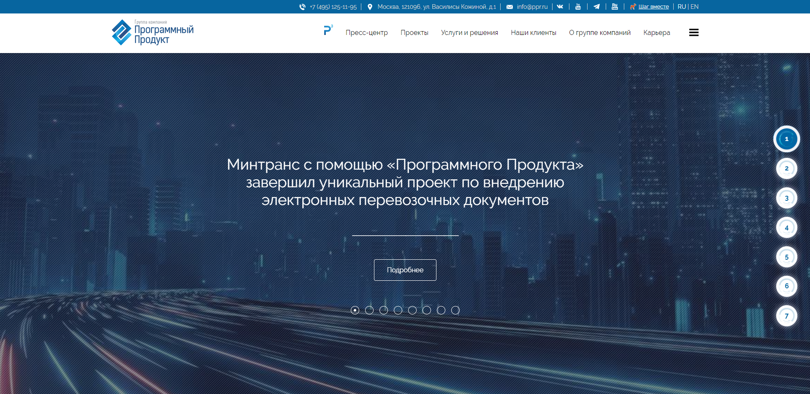
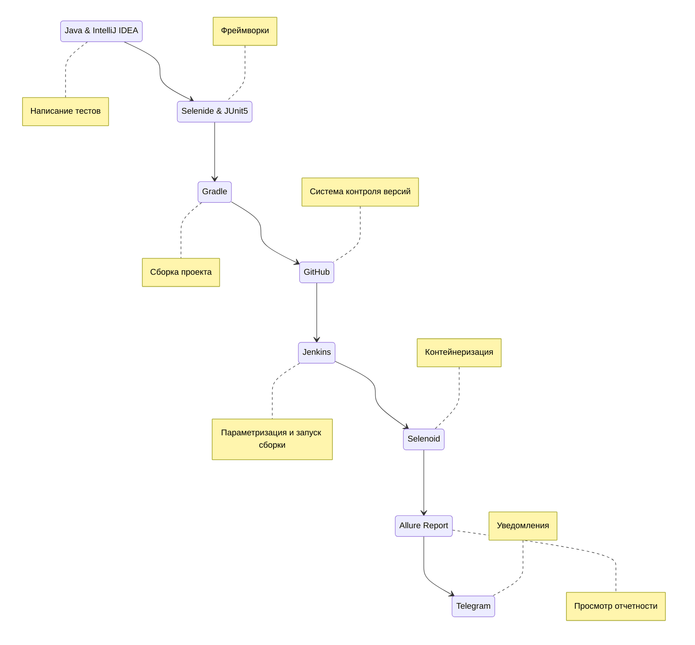
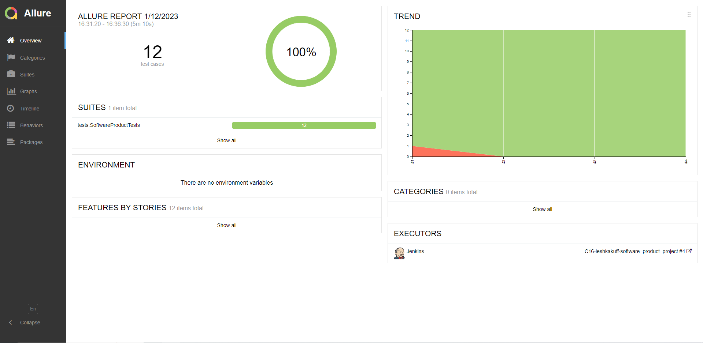
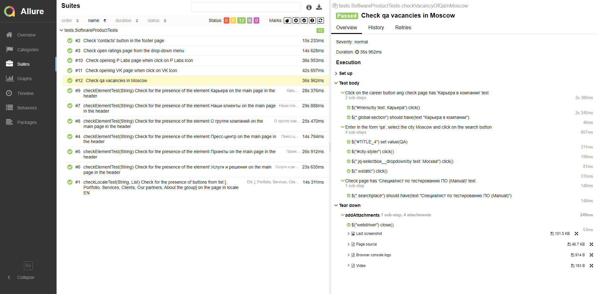
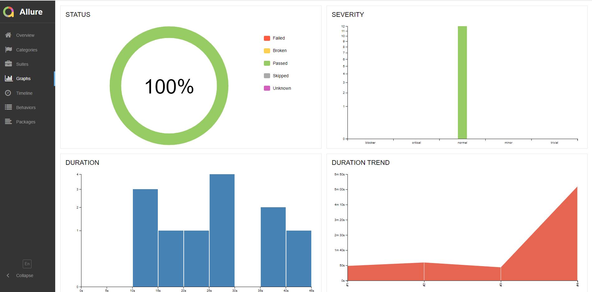
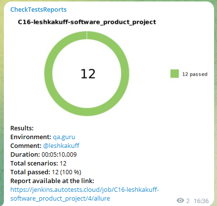

# Проект по автоматизированному тестированию сайта "Программный продукт"

<p align="center">

</p>

## :bookmark_tabs:    Содержание

➠ [Покрытый функционал](#checkered_flag-покрытый-функционал)

➠ [Технологический стек](#desktop_computer-Технологический-стек)

➠ [Запуск тестов из терминала](#key-запуск-тестов-из-терминала)

➠ [Удаленный запуск тестов в Jenkins](#удаленный-запуск-тестов)

➠ [Отчет о результатах тестирования в Allure Report](#-отчет-о-результатах-тестирования-в-allure-report)

➠ [Уведомления в Telegram с использованием бота](#-уведомления-в-telegram-с-использованием-бота)

➠ [Пример запуска теста в Selenoid](#-Пример-запуска-теста-в-Selenoid-из-отчета-Allure)
## <a name="checkered_flag-покрытый-функционал"></a>:checkered_flag: Покрытый функционал

### UI тесты

- [x] Проверка наличия кнопок в хедере в локали EN
- [x] Проверка наличия кнопок в хедере в локали RU
- [x] Проверка открытия страницы вк с группой компании при клике на иконку VK
- [x] Проверка открытия страницы P Labs при клике на иконку P
- [x] Проверка открытия страницы "Рейтинги" из выпадющего меню
- [x] Проверка вакансий тестировщика в Москве
- [x] Проверка наличия кнопки "Контакты" в футере страницы

## <a name="desktop_computer-Технологический стек"></a>:desktop_computer: Технологический стек

<p align="center">


</p>


## :key: Запуск тестов из терминала

### Локальный запуск тестов

```
gradle clean test
```

##  Удаленный запуск тестов в Jenkins

> Для запуска тестов используется параметризированная сборка
<p align="center">

</p>

##  Отчет о результатах тестирования в [Allure Report](https://jenkins.autotests.cloud/job/C16-leshkakuff-software_product_project/allure/)

### :large_orange_diamond: Главная страница Allure-отчета

<p align="center">

</p>

### :large_orange_diamond: Страница с тестами

<p align="center">

</p>

> Каждый тест имеет:
> - Скриншот
>- Page source
>- Browser console log
>- Видео

### :large_orange_diamond: Основной дашборд

<p align="center">

</p>

##  Уведомления в Telegram с использованием бота

> По результатам каждой сборки Telegram-бот отправляет отчет в специальный телеграм-чат. 
>
> Информация по настройке и использованию бота <code>https://github.com/qa-guru/allure-notifications</code>

<p align="center">

</p>

##  Пример запуска теста в Selenoid из отчета Allure

> К каждому тесту в отчете прилагается видео. Одно из таких видео представлено ниже.
<p align="center">
  
</p>

[:arrow_up:Содержание](#Содержание)
